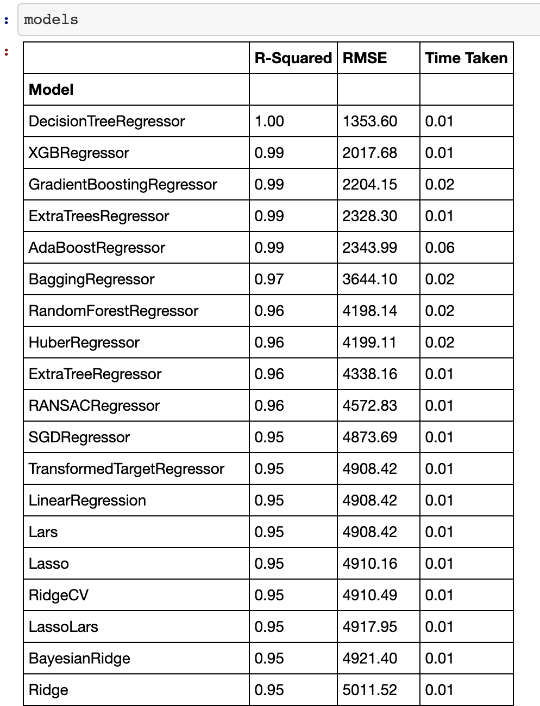
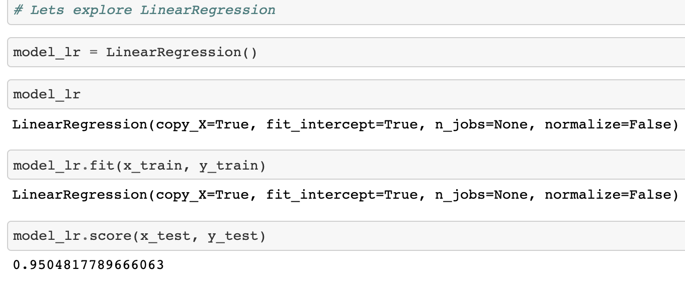

# Uber ride prediction

## Basic Overview:

* **Goal**: Create a model to predict the number of weekly riders a rideshare company like Uber should expect.

* Uber is a company that needs to be on top of their game to meet rideshare demands, if they underprepare to serve the number of potential riders they will lose big money. More importantly it will give more room for their competition to grow.

* Therefore, this model will help Uber to predict number of riders based on attributes such as population of a city, average income of residents of that city, and the average amount a rider spends on ride-share per week.

## Resources and code used:

* ***Python Version***: 3.8
* ***Packages***: Pandas, Matplotlib, NumPy, Pickle, Sklearn (Linear Regression, Lasso, train_test_split), LazyPredict
* ***Data Source***: Read only MySQL database 

## Data Acquisition:

* Obtained data from a MySQL database that updates daily with rideshare data.
* The reason for choosing this setting of data acquisition is to improve on SQL skills too.

## Data Cleaning:

  ### Attribute Selection & data preperation:
    
    * The dataset was first grouped in bins of populations.
    * All the missing values were replaced with means belonging to these bins.
    * The bin method ensures avoidance of outliers.
    * Using Inter-Quartile-Range the outliers were removed.  
    

## Model Building:

* Using LazyPredict library a quick analysis of how multiple algorithms perform with the data showed the following results:

* Therefore, from the above Linear Regression seemed the most sensible algorithm to use in building the model. Others algorithms showed signs of overfitting while the other half showed weakness in accuracy.

## Conclusion:

* Linear regression gave us the following result:

## Model Deployment:

* With the help of Pickle library the model was exported as an API.
* Using Flask a server was created to onboard the API and serve an interactable webpage that lets users input the location, bedrooms and bathroom to get the price prediction:

### The file with detailed step-by-step code is [here](/Machine_Learning.ipynb).
